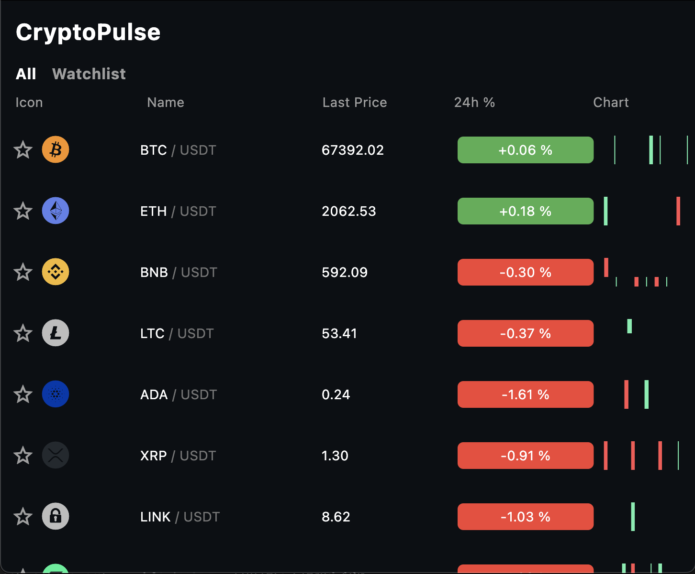
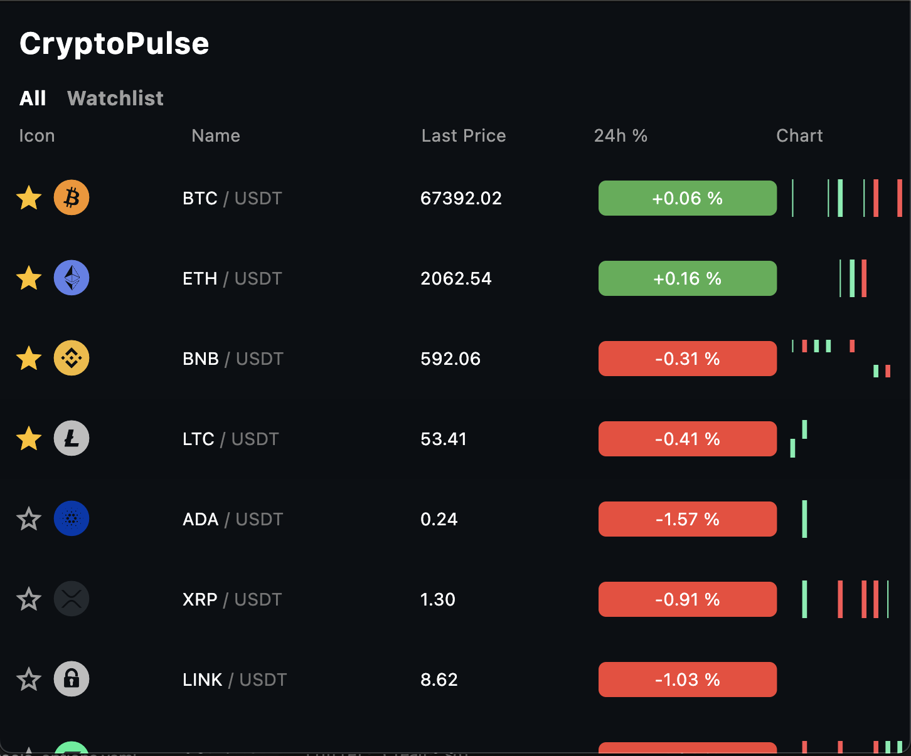
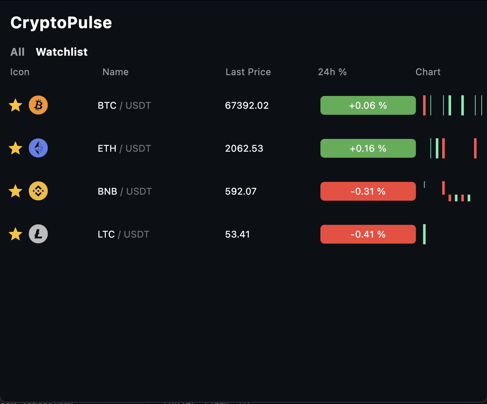
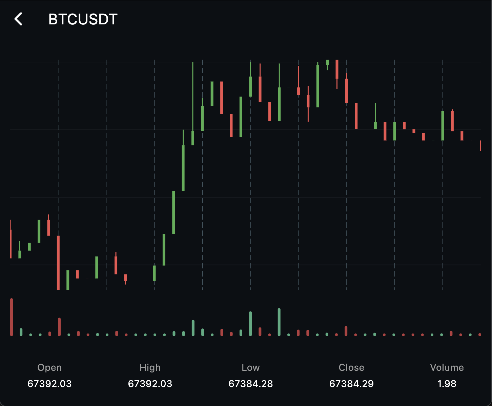

# CryptoPulse 📈

A **real-time cryptocurrency market dashboard** built with **Flutter**,
designed to demonstrate **high-frequency data streaming, clean
architecture, and performance optimization using isolates**.

CryptoPulse connects to the **Binance WebSocket API** to stream live
market data and displays it in an optimized UI that can handle frequent
updates efficiently.

---

# Demo

Live Web Demo:

https://mgsuper.github.io/cryptopulse/

---

# Screenshots

## Market Dashboard

Displays:

- real-time price updates
- 24h change
- mini sparkline charts
- watchlist support

---

## Add to Watchlist

Displays:

- add watchlist
- using hive database
- real time add/remove

---

## Watchlist

Displays:

- real-time price updates
- 24h change
- able to remove from watchlist

---

## Coin Detail Chart

Includes:

- candlestick chart
- volume bars
- zoom & pan
- live kline updates via WebSocket

---

# Features

### Real-time Market Streaming

- Binance **WebSocket ticker stream**
- live updates without polling
- efficient UI updates

### Candlestick Chart

- historical candles via REST API
- live kline updates via WebSocket
- interactive chart with zoom/pan

### Watchlist

- add/remove favorite coins
- reorder coins
- persisted using Hive

### Performance Optimization

Key optimizations:

- **Isolate-based processing** for ticker parsing
- **BlocSelector** to avoid unnecessary UI rebuilds
- **RepaintBoundary** to isolate expensive widgets
- **efficient stream pipeline**

---

# Architecture

This project follows **Clean Architecture principles** to maintain
separation between UI, domain logic, and data sources.

lib/ ├ core/ │ ├ di/ │ ├ network/ │ ├ utils/ │ ├ features/ │ ├ market/ │
│ ├ data/ │ │ ├ domain/ │ │ └ presentation/ │ │ │ ├ chart/ │ │ ├ data/ │
│ ├ domain/ │ │ └ presentation/ │ │ │ └ watchlist/ │ ├ data/ │ ├ domain/
│ └ presentation/

---

# Real-Time Data Pipeline

Binance WebSocket\
↓\
ExchangeSocket Service\
↓\
MarketRepository\
↓\
Isolate (data parsing)\
↓\
MarketBloc\
↓\
BlocSelector\
↓\
MarketRow Widgets

This pipeline ensures **minimal UI rebuilds** even when receiving
frequent market updates.

---

# Isolate Optimization

Crypto market streams can produce frequent updates.

To prevent blocking the UI thread, **ticker parsing is executed in a
separate isolate**.

Main Thread\
│\
│ WebSocket message\
▼\
Isolate\
│\
│ parse JSON\
│ convert to Ticker entity\
▼\
SendPort → Main thread

Benefits:

- UI remains smooth
- avoids frame drops
- handles high-frequency streams efficiently

For **Flutter Web**, isolates are not supported, so a fallback runs the
processing inline.

---

# State Management

The project uses **Flutter Bloc**.

Example flow:

WebSocket Event\
↓\
Repository Stream\
↓\
MarketBloc Event\
↓\
MarketState Update\
↓\
BlocSelector\
↓\
Single row rebuild

This ensures **only the updated coin row rebuilds**, rather than the
entire list.

---

# Technology Stack

Technology Purpose

---

Flutter UI framework
Flutter Bloc State management
Injectable + GetIt Dependency injection
Hive Local persistence
Dio REST API client
WebSocket Real-time data
FL Chart Candlestick chart

---

# Testing

Unit tests cover:

- MarketBloc
- WatchlistBloc
- ChartBloc

Run tests:

flutter test

---

# CI / CD

GitHub Actions automates:

- flutter analyze
- flutter test
- flutter build web

---

# Running the Project

Clone repository

git clone https://github.com/MgSuper/cryptopulse.git

Install dependencies

flutter pub get

Run app

flutter run

---

# Web Deployment

Build the web version:

flutter build web

Then deploy the `build/web` directory using:

- GitHub Pages
- Vercel
- Firebase Hosting

---

# Why This Project Exists

CryptoPulse was built as a **portfolio project focused on real-time
systems**.

Goals:

- demonstrate Flutter architecture
- show performance optimization techniques
- work with streaming market data
- build production-style state management

---

# Future Improvements

Possible improvements:

- portfolio tracking
- technical indicators (RSI, EMA, MACD)
- advanced chart intervals
- coin search
- multi-exchange support

---

# Author

Super

GitHub: https://github.com/MgSuper

---

# License

MIT License
